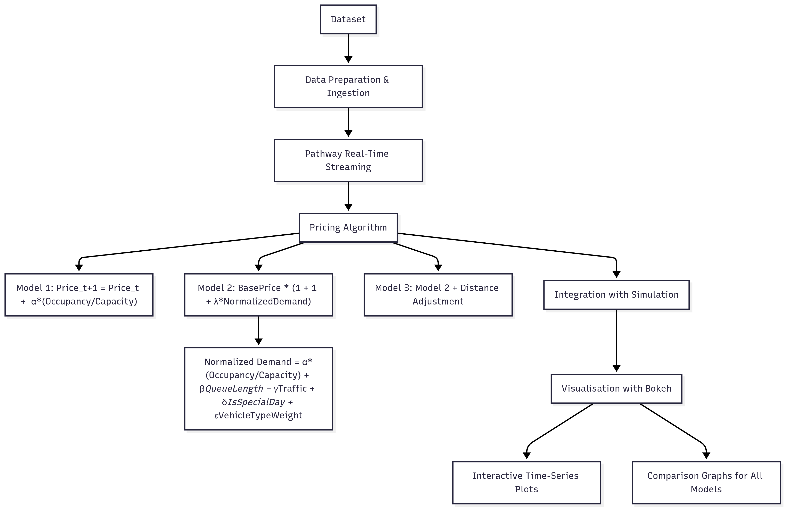

# Dynamic Pricing for Urban Parking Lots

---

## Overview
This project implements **dynamic pricing models** for urban parking lots using demand, competition, and real-time data features.  

We develop **three models** with increasing complexity:

<strong>Model 1: Baseline Linear Model</strong>

- Price responds linearly to occupancy.

<strong>Model 2: Demand-Based Function Model</strong>

- Uses a demand function with occupancy rate, queue length, traffic level, special day flag, and vehicle type.  
- Demand is normalised and price is bounded.

<strong>Model 3: Competitive Pricing Model (Optional)</strong>

- Adds location intelligence by using geographic proximity and competitor pricing to adjust rates competitively.

---

## Tech Stack

**Libraries & Frameworks:**
- [pandas](https://pandas.pydata.org/) and [numpy](https://numpy.org/) for data manipulation
- [pathway](https://pathway.com/) for real-time data streaming and simulation of the demand and pricing pipeline
- [bokeh](https://bokeh.org/) for interactive data visualisation

---

## Architecture Flow

<strong>1. Data Preparation & Ingestion</strong>

- The dataset contains time-stamped occupancy, queue, traffic, vehicle type, special day, and location.  
- Ingested using **Pathway** for real-time streaming simulation.

<strong>2. Pricing Algorithm</strong>

- Dynamic pricing logic for each model:
  - **Model 1:** `Price_t+1 = Price_t + α · (Occupancy/Capacity)`
  - **Model 2:** `Price_t = BasePrice · (1 + λ · NormalizedDemand)`  
    - Normalised demand formula:  
      `Demand = α·(Occupancy/Capacity) + β·QueueLength − γ·Traffic + δ·IsSpecialDay + ε·VehicleTypeWeight`
  - **Model 3:** Extends Model 2 by calculating distance between lots and adjusting prices accordingly.

- Integration with simulation to evaluate strategy performance.

<strong>3. Visualisation using Bokeh</strong>

- Created interactive time-series plots.  
- Comparison graphs across all three models.

---

## Architecture Diagram

---

## How to Run This Notebook

1. Open the notebook in **Google Colab**.  
2. Install required packages (*Pathway, Bokeh, Pandas*).  
3. Run the **Pathway streaming pipeline**.  
4. Once enough data is streamed, pause the pipeline.  
5. Continue executing the notebook to apply pricing models and **visualise results**.

---
